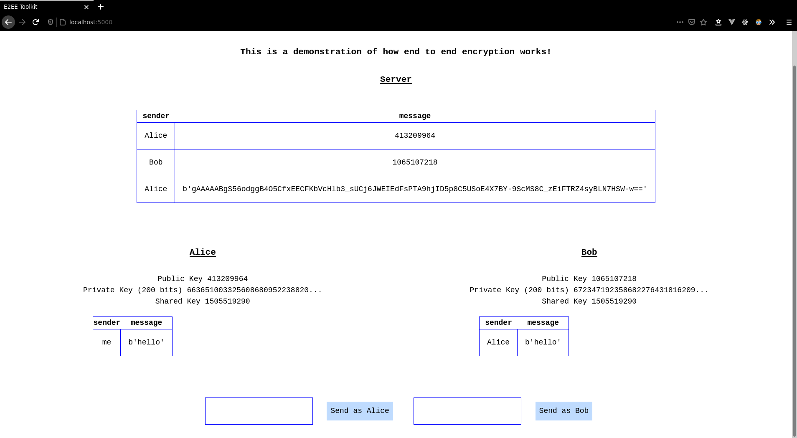

# UE20CS101 Project - E2EE toolkit

Of late there has been a lot of concern about what End-To-End Encryption really is, and how it works. This project is intended to serve as a live demonstration of what really happens when you start talking with someone on an app that offers end-to-end-encyption, including features that allow you to see both the encrypted and decrypted text being sent across.

We will demonstrate the [Diffie-Hellman Key Exchange](https://en.wikipedia.org/wiki/Diffie%E2%80%93Hellman_key_exchange) in a chat scenario, allowing you to simulate a chat environment of 2 users. You will be able to see both the encrypted and decrypted messages, but given that an understanding of the Exchange process is required to appreciate the working of the project, we consider this project to be more of a proof of concept than anything else.

The first two messages of the chat are the public keys of our participants, Alice and Bob. Another person, say Trudy, would not be able to reconstruct the encryption key formed due to the Diffie-Hellman Key Exchange protocol taking place in the first step, due to the difficulty of solving the discrete log problem. Once this step is over, all we see are the encrypted messages, proving that end-to-end encryption is indeed possible. 

The multiple views here show you what is seen to Bob and Alice, our participants, as well as the Server, which shows that even if a certain company _wanted_ to break end-to-end encryption on the chat, they would not be able to.

## Running The Demo
1. Clone this repo
2. Create a virtual environment with
```
$ virtualenv env --python=python3
```
3. Activate this environment by doing (for Linux Systems)
```
$ source env/bin/activate
```
Your prompt should look something like this
```
(env) $
```
4. Install all the dependencies with
```
(env) $ pip install -r requirements.txt
```
5. Once this is done, we can run the flask app
```
(env) $ export FLASK_APP=main.py
(env) $ flask run
```

## The current state of things


We decided to implement the interface in `flask`, using HTML, CSS and tailwind.css .


## Python Libraries Being Used
* `random`
* `math`
* `cryptography`
* `flask`

## Student Details
* Anish Cherekar (SRN `PES2UG20CS052`)
* Anurag Girish (SRN `PES2UG20CS057`)
* Anirudh Rowjee (SRN `PES2UG20CS050`)
